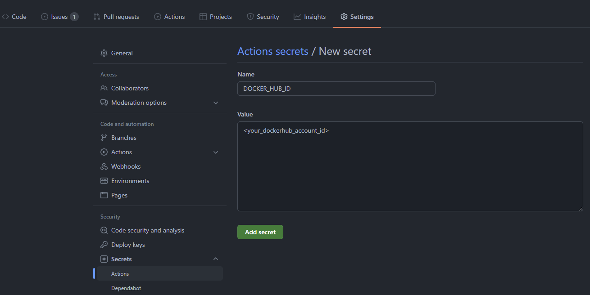

<!-- header -->
<div align="center">
    <p>
    <!-- Header -->
        
        <h2>template-ubuntu</h2>
        <p><i>cool-template-ubuntu-tagline</i></p>
    </p>
    <p>
    <!-- Shields -->
        <a href="https://github.com/armckinney/template-ubuntu/LICENSE">
            
        </a>
        <a href="https://github.com/armckinney/template-ubuntu/actions">
            
        </a>
        <a href="https://codecov.io/gh/armckinney/template-ubuntu">
            
        </a>
        <a href="https://github.com/armckinney/template-ubuntu/issues">
            
        </a>
        <a href="https://github.com/armckinney/template-ubuntu/pulls">
            
        </a>
        <a href="https://stackshare.io/armck/template-ubuntu">
            
        </a>
    </p>
    <p>
    <!-- Links -->
        <a href="https://github.com/armckinney/template-ubuntu/issues/new/choose">Report Bug</a>
        ·
        <a href="https://github.com/armckinney/template-ubuntu/issues/new/choose">Request Feature</a>
    </p>
</div>
<br>
<br>

<!-- Description -->
Here is where you can you a much longer description of your project. You might include features and inspiration here.

The `template-ubuntu` repository adds some nifty and time-saving features like:
- Automatic Pull Request Management
- Docker Compose
- Docker Build & Push Workflows
- MIT License
- Templates for:
  - .gitignore
  - .dockerignore
  - Project README
  - VS Code Settings
  - CI Workflows


### Quick Start

1. ###### Add DockerHub Secrets:
Add `DOCKER_HUB_ID` & `DOCKER_HUB_ACCESS_TOKEN` to GitHub repository. This will allow you to benefit from the build/push workflows in [ci.yml](./.github/workflows/ci.yml).



2. ###### Configure the init script:
This will allow you make quick changes to the template files that format them specifically for your project.
Do this by filling out the `.\ini\config\config.ini.json` with your own preferences.

3. ###### Run the init script:
This will allow you to auto-magically replace the `template-repo` name in the template files as well as configure the `ProjectLogo` image.

```powershell
./Initialize-TemplateRepository.ps1
```

*Note:* The project parent directory should match the GitHub project name.

4. ###### Clean up what you don't want:
Some items you might want to get rid of/update:
- `./ini/` directory and its contents
- Description, Quick Start, and Usage in this `README` file
- The lint / test jobs in `..github/workflows/ci.yml`

5. ###### Commit and Push your changes to GitHub:
This should update all of your badges, links, images, as well as run the inital CI workflow.


### Usage

It's as simple as making a new repository from this one and then follow the steps in the [Quick Start](#quick-start) section!

